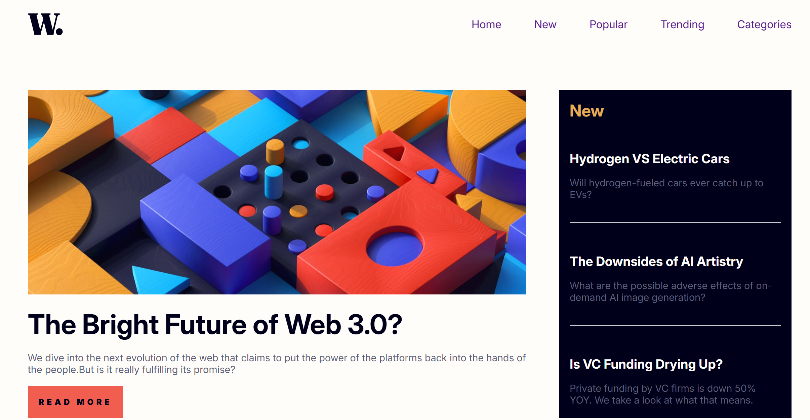
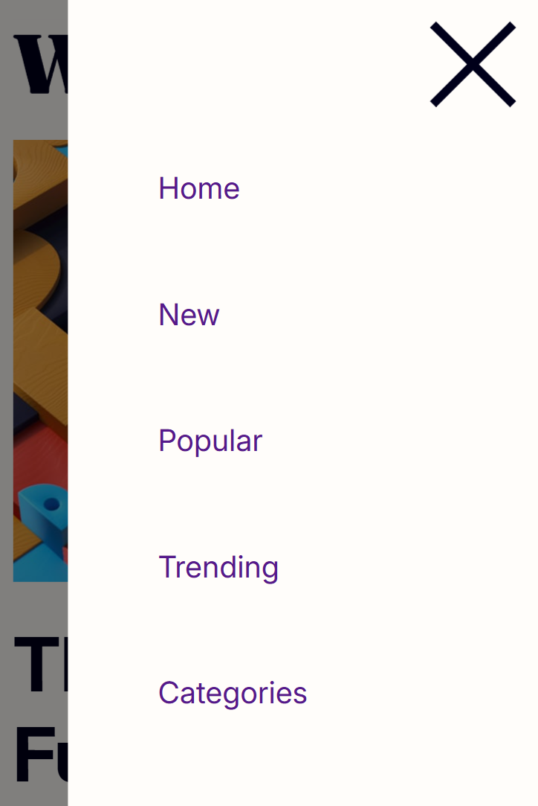

# Frontend Mentor - News homepage solution

This is a solution to the [News homepage challenge on Frontend Mentor](https://www.frontendmentor.io/challenges/news-homepage-H6SWTa1MFl). Frontend Mentor challenges help you improve your coding skills by building realistic projects. 

## Table of contents

- [Overview](#overview)
  - [The challenge](#the-challenge)
  - [Screenshot](#screenshot)
  - [Links](#links)
- [My process](#my-process)
  - [Built with](#built-with)
  - [What I learned](#what-i-learned)

## Overview

### The challenge

Users should be able to:

- View the optimal layout for the interface depending on their device's screen size
- See hover and focus states for all interactive elements on the page

### Screenshot





### Links

- Solution URL: [https://github.com/hrong1/News-homepage](https://github.com/hrong1/News-homepage)
- Live Site URL: [https://hrong1.github.io/News-homepage/](https://hrong1.github.io/News-homepage/)

## My process

### Built with

- Semantic HTML5 markup
- CSS custom properties
- Flexbox
- CSS Grid
- Mobile-first workflow

### What I learned

Learn about how to do the header and navigation Bar in web

```html
<header class="web-header" id="web-header">
    
    <button type="button" class="web-header__sidebar-toggle" id="sidebar-toggle" aria-label="Open navigation menu" aria-expanded="false" aria-controls="sidebar"></button>

    <nav class="web-header__sidebar" id="sidebar">
      <ul class="web-header__sidebar-list">
        <li><a href="#home">Home</a></li>
        <li><a href="#new">New</a></li>
        <li><a href="#popular">Popular</a></li>
        <li><a href="#trending">Trending</a></li>
        <li><a href="#categories">Categories</a></li>
      </ul>
    </nav>
    <div class="sidebar-overlay" id="sidebar-overlay"></div>
</header>
```